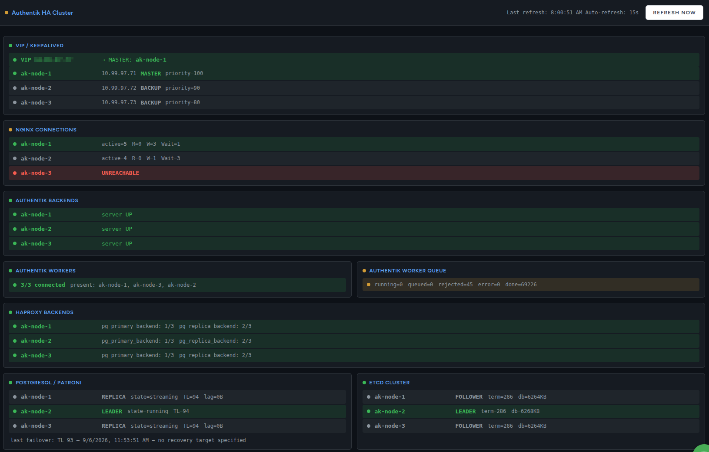

<p align="center">

</p>

<h1 align="center">akropolis-monitor</h1>

Operational TUIs for an **Authentik HA cluster**: Authentik, Patroni/PostgreSQL,
etcd, HAProxy, keepalived/VIP, nginx. Nothing here runs inside the cluster; it
connects out over HTTP and SSH from an operator's workstation.

```
akropolis-monitor dashboard      # real-time cluster health
akropolis-monitor logs           # warnings and errors from every node
```

Companion to [akropolis](https://github.com/ktsouvalis/akropolis), which
provisions the cluster this watches. akropolis emits a ready-made config file
for this tool at handoff.

---

## Install

Download the single-file executable from
[Releases](https://github.com/ktsouvalis/akropolis-monitor/releases). It carries
its own pure-Python dependencies; there is no install step and no virtualenv.

```bash
sudo apt install python3-cryptography python3-bcrypt python3-nacl python3-psycopg2
curl -fLO https://github.com/ktsouvalis/akropolis-monitor/releases/download/v1.0.0/akropolis-monitor
chmod +x akropolis-monitor
./akropolis-monitor --version
```

Those four packages are deliberately **not** bundled: zipimport cannot load
compiled extension modules out of a zip. Keeping them on the distribution's
package track also means `cryptography` keeps getting security updates instead
of being frozen inside a release artifact nobody re-cuts for six months.

`python3-psycopg2` is optional. Without it the dashboard runs normally but
omits the PostgreSQL replication-slot detail. The other three are required,
because paramiko will not import without them and `logs` is built on paramiko.

Verify the download with `sha256sum -c SHA256SUMS`.

<details>
<summary>From source instead</summary>

```bash
git clone https://github.com/ktsouvalis/akropolis-monitor
cd akropolis-monitor
python3 -m venv .venv && source .venv/bin/activate
pip install -e .
akropolis-monitor --version
```

To build the executable yourself: `PYTHON=python3.10 ./tools/build_pyz.sh`.
Python 3.10 is the reference interpreter; a build on a newer one runs fine
locally but will not match the release checksum, and may omit packages a 3.10
host needs.
</details>

---

## Configure

One YAML file per site.

```bash
cp config.yml.example config.yml
$EDITOR config.yml          # IPs, node names, ports, credentials
```

Run against a specific site by pointing at its file:

```bash
akropolis-monitor dashboard config.site-b.yml
akropolis-monitor logs --config config.site-b.yml
```

Note the asymmetry: `dashboard` takes the path as a bare positional argument,
`logs` takes `--config`. Both spellings predate this package and are in
operators' shell history, so they were kept rather than unified.

### Scheme / TLS (optional)

The per-node and VIP `/monitor` probes default to `https://<host>:443`, which
is correct for any TLS-terminating cluster. A cluster provisioned **without**
TLS serves plain HTTP on `:80`; probing it with `https://` marks every node
UNREACHABLE and, because nginx reachability is how keepalived state is
inferred, shows every node as FAULT with a phantom priority drop.

```yaml
scheme:
  nginx: "http"        # or "https" (default)
  nginx_port: 80       # or 443 (default; inferred from nginx when omitted)
  verify_tls: false    # true only for a publicly trusted certificate
```

Omit the block entirely and behaviour is exactly as before, so existing configs
need no changes. akropolis fills this in automatically in the config it emits
at handoff.

Authentik's own `:9443` health and API endpoints are unaffected: they are HTTPS
regardless of the nginx TLS provider, since `AUTHENTIK_LISTEN__HTTPS` is always
set.

---

## `dashboard`

Real-time TUI, one panel per service, refreshed every `refresh_interval`
seconds.

<p align="center">

</p>

| Panel | How |
|---|---|
| **VIP / keepalived / nginx** | `/monitor` on each node and on the VIP; infers the track script's state and effective priorities |
| **nginx connections** | `/nginx_status` per node: active, reading, writing, waiting |
| **Authentik backends** | `/-/health/live/` per node |
| **Authentik workers** | `GET /api/v3/tasks/workers/`, mapped back to nodes |
| **Authentik worker queue** | `GET /api/v3/tasks/tasks/status/`: queued, running, rejected, errored |
| **HAProxy backends** | parses `/stats;csv`: per-backend UP/DOWN, request rate, 5xx |
| **PostgreSQL / Patroni** | `GET :8008/`: role, state, timeline, replication lag, replication slots, last failover |
| **etcd** | `/health` plus `POST /v3/maintenance/status`: leader, raft term, db size |

Worker health is read from the task API, not from `/-/health/live/` on `:9080`.
That endpoint is the Rust/axum liveness server and stays 200 even when the
dramatiq consumer is dead, so it must never be used to judge worker health.

| Indicator | Meaning |
|---|---|
| ${\color{green}●}$ Green | Up, and in the primary/active/leader role |
| ${\color{gray}●}$ Grey | Up, in a backup/replica/follower role (healthy, non-primary) |
| ${\color{yellow}●}$ Yellow | Degraded: partial backends up, replica not streaming, slots lagging |
| ${\color{red}●}$ Red | Down or unreachable |

Set `unicode_bullets: false` if your terminal renders `●` as an underscore,
which is common in Proxmox containers without a UTF-8 locale.

| Key | Action |
|---|---|
| `R` | Force immediate refresh |
| `Q` | Quit |
| `Ctrl+P` | Command palette |

---

## `logs`

Collects warnings and errors from every service on every node over SSH.
Containerised services are read with `docker logs`, bare-metal ones from
`journalctl`.

```bash
akropolis-monitor logs                          # TUI, last 24h, warning and above
akropolis-monitor logs --last 6 --level error
akropolis-monitor logs --save cluster_logs      # writes cluster_logs.log, no TUI
```

`--level` takes `debug`, `info`, `warning` (default) or `error`. Each level
includes everything at or above it in severity, matching `journalctl -p`
semantics. `debug` disables filtering entirely.

In TUI mode there is a tab per node, with a sub-tab per service; results stream
in as each SSH call returns. `--save` writes a structured plain-text report
instead and prints progress to stdout; the `.log` extension is appended if
omitted.

Which services get polled is config, not code:

```yaml
services:
  - label: "Auth Server"
    nodes: authentik       # a key from the nodes: map, or "keepalived"
    type: docker
    container: "authentik-server-1"

  - label: "Patroni"
    nodes: patroni
    type: systemd
    unit: "patroni"
```

Needs SSH access to every node (`ssh.username` and `ssh.key_file` in the
config), plus the Docker CLI and `journalctl` on the nodes that run them.

---

## Built with

Bundled inside the released executable, as source, under their own licenses.
`THIRD_PARTY_LICENSES.md` ships with every release and is generated from what
actually got bundled rather than hand-maintained.

| Package | License | Used for |
|---|---|---|
| [Textual](https://textual.textualize.io/) | MIT | Both TUIs |
| [Rich](https://github.com/Textualize/rich) | MIT | Terminal markup and colour |
| [requests](https://requests.readthedocs.io/) | Apache-2.0 | Every HTTP probe |
| [urllib3](https://urllib3.readthedocs.io/) | MIT | HTTP transport, TLS warning suppression |
| [PyYAML](https://pyyaml.org/) | MIT | Config parsing |
| [paramiko](https://www.paramiko.org/) | **LGPL-2.1** | SSH for `logs` |

Supplied by the system rather than bundled: `cryptography` (Apache-2.0 / BSD),
`bcrypt` (Apache-2.0), `PyNaCl` (Apache-2.0), `psycopg2` (LGPL-3.0 with
exceptions).

paramiko is the one bundled dependency that is not permissively licensed. The
copy inside the archive is unmodified, readable Python source sitting next to
the license that covers it.

---

## Notes

- Authentik TLS verification is disabled (`verify=False`) for the `:9443`
  health and API probes, since those backends use self-signed or internal
  certs. This is intentional and scoped to those requests; the nginx probes
  have their own `scheme.verify_tls` setting.
- `*.yml` and `*.csv` are gitignored. Only `config.yml.example` is tracked, so
  real site configs and their credentials stay out of the repository.

## License

MIT. See [LICENSE](LICENSE).
